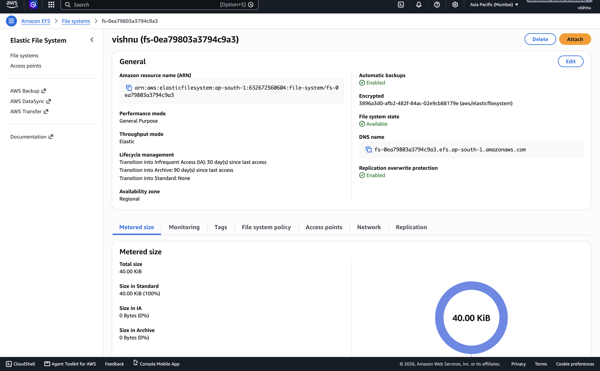

# 🚀 Highly Available Web Application on AWS

A production-style AWS project that demonstrates how to build a **Highly Available** and **Scalable Web Application** using **Amazon EC2**, **Application Load Balancer (ALB)**, **Auto Scaling Group (ASG)**, and **Amazon Elastic File System (EFS)**.

---

# 📖 Project Overview

This project implements a highly available web application architecture on AWS.

The application is deployed on multiple EC2 instances managed by an Auto Scaling Group. An Application Load Balancer distributes incoming traffic across healthy instances, while Amazon EFS provides shared storage so every EC2 instance serves the same website content.

The infrastructure is designed to improve **availability**, **fault tolerance**, and **scalability**.

---

# 🏗️ Architecture

```
                           Internet
                               │
                               ▼
                  Application Load Balancer
                               │
                         Target Group
                               │
              ┌────────────────┴────────────────┐
              ▼                                 ▼
        EC2 Instance 1                   EC2 Instance 2
       (Apache + EFS)                  (Apache + EFS)
              ▲                                 ▲
              └──────────────┬──────────────────┘
                             │
                    Auto Scaling Group
                             │
                      Launch Template
                             │
                             ▼
                  Amazon Elastic File System
                            (EFS)
```

---

# 🛠 AWS Services Used

- Amazon EC2
- Amazon EFS
- Application Load Balancer (ALB)
- Auto Scaling Group (ASG)
- Launch Template
- Target Group
- Security Groups
- Ubuntu Server
- Apache2 Web Server

---

# ⚙️ Project Workflow

### Step 1
Created an Amazon EFS file system with mount targets.

### Step 2
Launched Ubuntu EC2 instances.

### Step 3
Installed Apache2 Web Server.

### Step 4
Installed NFS utilities.

### Step 5
Mounted Amazon EFS to:

```
/mnt/efs
```

### Step 6
Configured Apache to serve website files stored in Amazon EFS.

### Step 7
Created a Launch Template containing:

- Ubuntu AMI
- Instance Type
- Security Group
- Key Pair
- User Data Script

### Step 8
Created an Auto Scaling Group using the Launch Template.

### Step 9
Created a Target Group.

### Step 10
Attached the Auto Scaling Group to the Target Group.

### Step 11
Created an Application Load Balancer.

### Step 12
Configured ALB Listener (HTTP :80).

### Step 13
Verified Target Group Health Checks.

### Step 14
Accessed the application using the ALB DNS Name.

---

# 🚀 Features

- Highly Available Architecture
- Horizontal Auto Scaling
- Automatic EC2 Provisioning
- Shared Storage using Amazon EFS
- Load Balancing using ALB
- Automatic Health Checks
- Launch Template Automation
- Fault Tolerant Design
- Shared Website Across Multiple Servers

---

# 📂 Repository Structure

```
aws-highly-available-web-app/
│
├── README.md
├── web code
└── screenshots/
    ├── architecture.png
    ├── ec2.png
    ├── launch-template.png
    ├── auto-scaling-group.png
    ├── target-group.png
    ├── load-balancer.png
    ├── efs.png
    ├── mounted-efs.png
    └── webpage.png
```

---

# 📸 Screenshots
## Vpc
```
screenshots/VPC.png
```
---


## EC2 Instances

```
https://github.com/viishnuR/Highly-Available-Web-Application-on-AWS/blob/155936ecac664f13a8f299adf5b94414c3034149/screenshots/ec2%20ASG.png
```

---

## Launch Template

```

```

---

## Auto Scaling Group
```
[screenshots/ASG.png](https://github.com/viishnuR/Highly-Available-Web-Application-on-AWS/blob/858f4239f2adb2bdd5e351ba696bf88a86b06abf/screenshots/ASG.png)
```
---
```
](https://github.com/viishnuR/Highly-Available-Web-Application-on-AWS/blob/858f4239f2adb2bdd5e351ba696bf88a86b06abf/screenshots/ASG%20log.png)
```
---

## Application Load Balancer

```
[screenshots/ELB.png](https://github.com/viishnuR/Highly-Available-Web-Application-on-AWS/blob/858f4239f2adb2bdd5e351ba696bf88a86b06abf/screenshots/ELB.png)
```

---

## Amazon EFS

```
[](https://github.com/viishnuR/Highly-Available-Web-Application-on-AWS/blob/858f4239f2adb2bdd5e351ba696bf88a86b06abf/screenshots/EFS.png)
```

---

## Final Web Application

```
https://github.com/viishnuR/Highly-Available-Web-Application-on-AWS/blob/155936ecac664f13a8f299adf5b94414c3034149/screenshots/scr1.png
```

---
```
https://github.com/viishnuR/Highly-Available-Web-Application-on-AWS/blob/155936ecac664f13a8f299adf5b94414c3034149/screenshots/scr2.png
```
---
```
https://github.com/viishnuR/Highly-Available-Web-Application-on-AWS/blob/155936ecac664f13a8f299adf5b94414c3034149/screenshots/scr3.png
```
---
```
https://github.com/viishnuR/Highly-Available-Web-Application-on-AWS/blob/155936ecac664f13a8f299adf5b94414c3034149/screenshots/scr4.png
```
---
```
https://github.com/viishnuR/Highly-Available-Web-Application-on-AWS/blob/155936ecac664f13a8f299adf5b94414c3034149/screenshots/scr5.png
```

# 📜 User Data Script

The Launch Template automatically performs:

- System Update
- Apache Installation
- NFS Installation
- Amazon EFS Mount
- Apache Configuration
- Automatic Apache Startup

---

# ✅ Validation Performed

- Successfully connected EC2 to Amazon EFS
- Mounted EFS on multiple EC2 instances
- Verified shared website content across all instances
- Configured Apache to serve files from EFS
- Successfully created Launch Template
- Successfully launched EC2 instances using Auto Scaling Group
- Verified Target Group health checks
- Verified Application Load Balancer routing
- Successfully accessed the application using the ALB DNS name

---

# 🎯 Skills Demonstrated

- Amazon EC2
- Amazon EFS
- Application Load Balancer (ALB)
- Auto Scaling Group (ASG)
- Launch Templates
- Target Groups
- Apache2
- Linux Administration
- SSH Authentication
- NFS File System
- AWS Networking
- Security Groups
- High Availability Architecture
- Infrastructure Automation

---

# 🔮 Future Improvements

- HTTPS using AWS Certificate Manager (ACM)
- Route 53 Custom Domain
- CloudWatch Monitoring & Alarms
- AWS WAF Integration
- AWS CodeDeploy
- AWS CodePipeline (CI/CD)
- Terraform Infrastructure as Code
- Docker Containerization
- Amazon ECS Deployment

---

# 📚 Learning Outcomes

Through this project, I learned how to:

- Build a highly available web architecture on AWS.
- Configure shared storage using Amazon EFS.
- Automate EC2 provisioning with Launch Templates.
- Scale applications automatically using Auto Scaling Groups.
- Distribute traffic using an Application Load Balancer.
- Configure Apache to serve content from shared storage.
- Understand AWS networking, security groups, and health checks.

---

# 👨‍💻 Author

**Vishnu R**

Cloud & DevOps Enthusiast

- GitHub: https://github.com/viishnu
- LinkedIn: www.linkedin.com/in/vishnu-r14200407

---

## ⭐ If you found this project useful, please consider giving it a Star!
